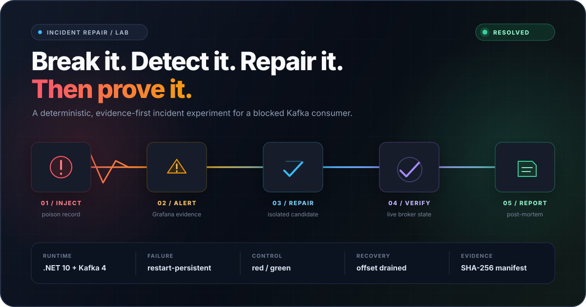
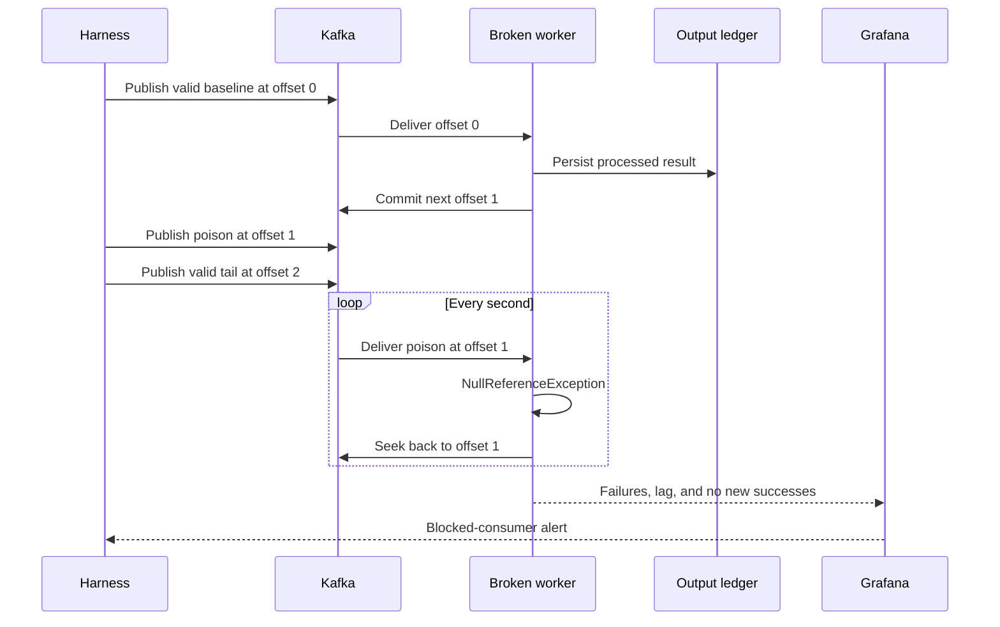
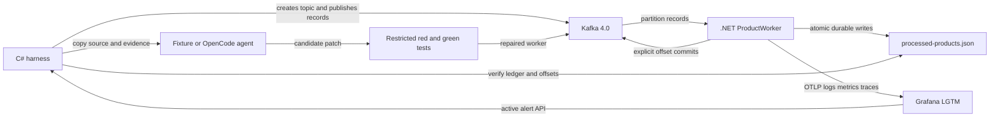

# Incident Repair Harness

<p align="center">
  
</p>

<p align="center">
  <strong>A real incident. Preserved state. A repair that has to earn the green.</strong><br>
  Deterministically reproduce, detect, repair, verify, and document a Kafka consumer blocked by a poison record.
</p>

<p align="center">
  <a href="#quick-start"><strong>Run the experiment</strong></a> &nbsp;|&nbsp;
  <a href="#what-to-observe">See the failure</a> &nbsp;|&nbsp;
  <a href="#repair-lifecycle">Inspect the proof gates</a> &nbsp;|&nbsp;
  <a href="#artifacts">Explore the evidence</a>
</p>

We created it to test incident-repair workflows against a real failure rather than a toy code-editing task. Every run starts from the same intentional defect, preserves the broken Kafka and ledger state during repair, and records enough evidence to explain whether the repair actually restored progress.

The harness and worker are implemented in C# on .NET 10. Kafka, Grafana LGTM, restricted repair candidates, and the optional coding agent run in containers.

## What This Delivers

<table>
  <tr>
    <td width="33%" valign="top">
      <strong>Real failure mechanics</strong><br><br>
      A poison record blocks an actual Kafka partition. Retries, lag, durable output, and committed offsets all behave as they would in production.
    </td>
    <td width="33%" valign="top">
      <strong>Observable detection</strong><br><br>
      OpenTelemetry signals reach Grafana LGTM and a provisioned alert must fire before repair begins.
    </td>
    <td width="33%" valign="top">
      <strong>Preserved incident state</strong><br><br>
      The repair faces the original broker, consumer group, blocked offset, and durable ledger. There is no clean-state shortcut.
    </td>
  </tr>
  <tr>
    <td width="33%" valign="top">
      <strong>Restricted repair</strong><br><br>
      Fixture or OpenCode candidates run non-root, read-only, capability-free, network-restricted, and against a frozen source manifest.
    </td>
    <td width="33%" valign="top">
      <strong>Independent proof</strong><br><br>
      Red control, green candidate, malformed-input policy checks, live recovery, a fresh random probe, and a drained partition.
    </td>
    <td width="33%" valign="top">
      <strong>Auditable result</strong><br><br>
      Every run retains the exact diff, logs, checks, ledger, verdict, hashes, and an evidence-grounded post-mortem for OpenCode runs.
    </td>
  </tr>
</table>

## Quick Start

### Prerequisites

Install:

- [.NET SDK 10](https://dotnet.microsoft.com/download/dotnet/10.0)
- Docker or Podman with Compose support
- Git
- POSIX `patch`

`global.json` pins SDK `10.0.103` with latest-patch roll-forward.

The first run needs internet access to restore NuGet packages, pull the pinned Kafka and Grafana images, and build the local agent image. Ports `3000`, `3100`, `4318`, `9090`, and `9092` must be free.

The harness supports macOS and Linux. It automatically uses Docker when both Docker and Podman are available and working.

### Clone and run

Run all commands from the repository root:

```bash
git clone https://github.com/bulatgrzegorz/incident-repair-harness.git
cd incident-repair-harness

dotnet run --project harness/dotnet/IncidentHarness.csproj -- prepare --agent fixture
dotnet run --project harness/dotnet/IncidentHarness.csproj -- doctor
dotnet run --project harness/dotnet/IncidentHarness.csproj -- run --agent fixture
```

`prepare` builds the restricted SDK image used to compile, test, and run repair candidates. It comes before `doctor` because the prepared image is one of the checks.

A successful run ends with output similar to:

```text
✓ INCIDENT RESOLVED
Poison rejected | tail processed | partition drained | 61.7s
Evidence  /path/to/incident-repair-harness/runs/20260911T131943Z-de42b209
```

The full run can take a few minutes, especially while Grafana waits for telemetry and evaluates the alert.

## What to Observe

The harness publishes three records to one Kafka partition:

| Offset | Record | Behavior before repair |
| ---: | --- | --- |
| `0` | Valid physical product | Processed and committed |
| `1` | Product with `productType: null` | Throws, seeks, and retries forever |
| `2` | Valid digital product | Blocked behind offset `1` |

The important behavior is not merely the exception. The committed-next offset stays at `1`, the durable ledger contains only the baseline record, consumer lag remains positive, and a Grafana alert fires. The harness restarts the worker once to prove that the blockage survives a process restart.



The fixture repair rejects missing product types as `missing_product_type`. It must pass a red/green regression check, four malformed-input policy checks, and recovery against the original broker and ledger state. Finally, a random valid probe proves that processing continues beyond the known tail record.

## System Overview



The worker disables Kafka auto-commit. For each record it computes a payload hash, checks the replay-aware ledger, processes the payload, atomically persists the result, and only then commits the offset. That ordering makes a replay after a crash idempotent.

The intentional defect is in `src/ProductWorker/ProductProcessor.cs`: the processor dereferences `productType` before checking whether it is null. `KafkaWorker` treats the resulting exception as retryable, seeks back to the same record, and therefore blocks everything behind it.

## Repair Lifecycle

```mermaid
flowchart LR
    A[Preflight] --> B[Process baseline]
    B --> C[Inject poison and tail]
    C --> D[Observe retries and alert]
    D --> E[Restart broken worker]
    E --> F[Prepare candidate]
    F --> G[Freeze source manifest]
    G --> H[Run red control]
    H --> I[Run candidate and policy checks]
    I --> J[Replace worker]
    J --> K[Verify recovery and fresh probe]
    K --> L[Generate post-mortem]
    L --> M[Finalize artifact manifest]
```



The repair gates are designed to prevent a superficially green result:

- Candidate source is copied and frozen before testing.
- Symlinks, hard links, oversized files, and unexpected source changes are rejected.
- The regression fails against the original processor with `NullReferenceException`.
- The same regression passes against the candidate.
- Missing, null, empty, and whitespace `productType` values are rejected without throwing.
- The candidate runs read-only, non-root, capability-free, and without package-restore network access.
- The original baseline remains preserved.
- The poison record is rejected and the known tail record is processed.
- A random fresh probe is processed.
- The committed Kafka offset reaches the partition log end.

## Commands

Show CLI help:

```bash
dotnet run --project harness/dotnet/IncidentHarness.csproj -- --help
```

| Command | Purpose |
| --- | --- |
| `prepare --agent fixture` | Build the restricted candidate image |
| `prepare --agent opencode` | Build the agent image and pull the proxy image |
| `doctor [--agent fixture\|opencode]` | Check tools, Compose, runtime, and images |
| `smoke [--keep]` | Reproduce the incident without repairing it |
| `run [--agent fixture] [--keep]` | Run the deterministic repair experiment |
| `run --agent opencode --model ... --credential-env ...` | Run an agent-authored repair experiment |
| `inspect --run <run-id>` | Print a finalized verdict |

## Running Modes

### Reproduce without repair

Reproduce the blocked consumer without applying a repair:

```bash
dotnet run --project harness/dotnet/IncidentHarness.csproj -- smoke
```

Smoke mode records incident evidence under `runs/` but does not create a finalized verdict.

### Deterministic fixture repair

Fixture mode applies `fixtures/known-good.patch` inside a copied candidate workspace. The checked-in worker remains intentionally broken.

```bash
dotnet run --project harness/dotnet/IncidentHarness.csproj -- \
  run --agent fixture
```

This is the default, deterministic, and provider-free path.

### OpenCode repair

OpenCode mode asks a coding agent to diagnose the captured Grafana alert and produce the candidate repair.

Use a dedicated low-budget provider key:

```bash
export OPENAI_API_KEY=...

dotnet run --project harness/dotnet/IncidentHarness.csproj -- prepare --agent opencode

dotnet run --project harness/dotnet/IncidentHarness.csproj -- doctor --agent opencode

dotnet run --project harness/dotnet/IncidentHarness.csproj -- \
  run --agent opencode \
  --model openai/<model> \
  --credential-env OPENAI_API_KEY
```

`anthropic/<model>` is also allowlisted with an explicitly named credential variable such as `ANTHROPIC_API_KEY`.

The coding container receives only the candidate workspace, captured alert, structured worker failures with stack traces, captured Kafka records, and repair prompt. After independent recovery verification, the same OpenCode session is continued with the candidate mounted read-only and the incident, diff, test, and verification evidence needed to write the post-mortem. Its network is routed through a provider-only Squid proxy. Web tools, search, MCP, and subagents are disabled. The credential value is passed through the named environment variable and is not written into command arguments or run artifacts; transient session state is deleted before finalization.

OpenCode must change exactly:

- `src/ProductWorker/ProductProcessor.cs`
- `tests/ProductWorker.Tests/ProductProcessingTests.cs`

The regression must drive the worker through Kafka and assert durable output and committed offsets. The harness executes it against the original source as a red control and against the candidate on the isolated application network.

The OpenCode path is implemented but still requires an independent live provider validation before production use.

### Keep the environment

Both `smoke` and `run` normally remove Compose containers and volumes while retaining `runs/<run-id>/`. Add `--keep` to preserve Kafka, Grafana, and their state for manual inspection:

```bash
dotnet run --project harness/dotnet/IncidentHarness.csproj -- run --agent fixture --keep
```

Grafana is then available at [http://localhost:3000](http://localhost:3000) with `admin` / `admin`. Use the Compose project name from `run.json` when you are ready to remove the retained environment.

## Artifacts

Successful runs retain evidence under `runs/<run-id>/`:

- `run.json`: run identity and environment
- `events.jsonl`: completed experiment phases
- `incident.json`: blocked offset, retries, restart, and Grafana alert
- `source.diff`: exact repair under test
- `candidate-source-manifest.json`: frozen source sizes and hashes
- `red-control.log`: proof that the functional regression fails on the original source
- `candidate-test.log`: repaired candidate functional-test result
- `policy-results.json`: malformed-input policy results
- `verification.json`: recovery checks
- `post-mortem.md`: model-authored incident report grounded in verified evidence (OpenCode runs)
- `output/processed-products.json`: final durable ledger
- `verdict.json`: machine-readable outcome
- `manifest.json`: retained artifact sizes and SHA-256 hashes

Inspect a finalized verdict:

```bash
dotnet run --project harness/dotnet/IncidentHarness.csproj -- \
  inspect --run <run-id>
```

Failed or interrupted runs retain partial evidence but do not receive an inspectable finalized verdict.

## Tests

Run the C# harness tests:

```bash
dotnet run --project tests/IncidentHarness.Tests/IncidentHarness.Tests.csproj
```

Run the processor and ledger smoke checks:

```bash
dotnet run --project tests/ProductWorker.Smoke/ProductWorker.Smoke.csproj
```

Run the Kafka and Aspire functional test:

```bash
dotnet restore tests/ProductWorker.Tests/ProductWorker.Tests.csproj --locked-mode
dotnet run --project tests/ProductWorker.Tests/ProductWorker.Tests.csproj \
  --configuration Release --no-restore -- \
  --report-trx \
  --report-trx-filename local.trx \
  --results-directory TestResults/local
```

For Podman/Testcontainers, you may also need:

```bash
export DOCKER_HOST="unix://$(podman machine inspect --format '{{.ConnectionInfo.PodmanSocket.Path}}')"
export TESTCONTAINERS_RYUK_DISABLED=true
```

## Direct Worker Check

Process one payload without Kafka:

```bash
dotnet run --project src/ProductWorker/ProductWorker.csproj -- \
  '{"productId":"P-1","productType":"Physical","price":100}'
```

Expected result:

```json
{
  "disposition":"processed",
  "productId":"P-1",
  "normalizedType":"physical",
  "price":100,
  "reasonCode":null
}
```

## Repository Layout

```text
agent/                         Restricted repair task given to OpenCode
docs/                          Compatibility notes and validated environment
fixtures/known-good.patch      Deterministic repair oracle
harness/dotnet/                C# CLI, orchestration, evidence, and artifacts
infrastructure/                Compose, Grafana alert, agent image, and proxy policy
src/ProductWorker/             Intentionally broken .NET Kafka worker
tests/IncidentHarness.Tests/   Focused C# harness tests
tests/ProductWorker.Smoke/     Fast processor and ledger executable checks
tests/ProductWorker.Tests/     TUnit and Testcontainers functional test
runs/                          Ignored, retained experiment artifacts
```

## From POC to Production

This harness is a proof of concept for a capability that could run inside a company's incident-response platform. In a production environment, the agent would correlate a much larger stream of signals across message brokers, REST and gRPC calls, microservices, GitHub repositories, deployment history, and Kubernetes clusters. It would also need service ownership data, secure read-only access, strict isolation, audit trails, approval gates, and reliable handling of incomplete or conflicting evidence.

The goal is not necessarily autonomous deployment. A useful first step is an automated first responder that begins investigating as soon as an alert fires. Before the first developer opens Grafana or Datadog, they could receive a report describing the affected service and request path, the evidence already checked, the most likely root cause, the confidence and remaining unknowns, and a proposed code or operational fix. The developer still makes the decision, but starts with a tested hypothesis instead of an empty dashboard.

## Current Boundaries

This is an experiment harness, not a production deployment system. Current limits are intentional and visible:

- Fixed host ports prevent concurrent local experiments.
- macOS and Linux are supported; Windows process and filesystem behavior is not implemented.
- Alert detection verifies the active Grafana alert by name.
- Candidate execution uses frozen SDK-image build output rather than a runtime-only image.
- Recovery telemetry stability and crash injection between persistence and commit are not implemented.

See [`docs/compatibility.md`](docs/compatibility.md) for validated versions and platform details.
