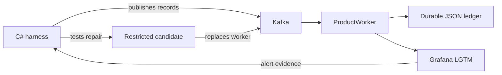

# Incident Repair Harness

A deterministic .NET 10 experiment that reproduces, detects, repairs, and verifies a Kafka consumer blocked by a poison record.

The harness creates a real Kafka incident, confirms it through durable state and Grafana telemetry, tests a repair in restricted containers, replaces the broken worker, and verifies that the original partition resumes processing.

## Architecture



The main components are:

- `harness/dotnet/`: Spectre.Console CLI and experiment orchestration
- `src/ProductWorker/`: intentionally defective .NET Kafka worker
- `tests/ProductWorker.Smoke/`: fast processor and ledger checks
- `tests/ProductWorker.Tests/`: Kafka and telemetry functional tests
- `tests/IncidentHarness.Tests/`: focused harness tests
- `infrastructure/`: Compose, Grafana alerting, agent image, and proxy policy
- `fixtures/known-good.patch`: deterministic repair used by fixture mode

## Prerequisites

Install:

- [.NET SDK 10](https://dotnet.microsoft.com/download/dotnet/10.0)
- Docker or Podman with Compose support
- Git
- POSIX `patch`

`global.json` pins SDK `10.0.103` with latest-patch roll-forward.

The first run needs internet access to restore NuGet packages, pull the pinned Kafka and Grafana images, and build the local agent image. Ports `3000`, `3100`, `4318`, `9090`, and `9092` must be free.

The harness supports macOS and Linux. It automatically uses Docker when both Docker and Podman are available and working.

## Quick Start

Run commands from the repository root.

Prepare the restricted candidate image:

```bash
dotnet run --project harness/dotnet/IncidentHarness.csproj -- \
  prepare --agent fixture
```

Check the local environment:

```bash
dotnet run --project harness/dotnet/IncidentHarness.csproj -- doctor
```

Run the deterministic repair experiment:

```bash
dotnet run --project harness/dotnet/IncidentHarness.csproj -- \
  run --agent fixture
```

A successful run prints its evidence directory and ends with `INCIDENT RESOLVED`.

## Incident Scenario

The harness publishes three records to one Kafka partition:

| Offset | Record | Behavior before repair |
| ---: | --- | --- |
| `0` | Valid physical product | Processed and committed |
| `1` | Product with `productType: null` | Throws, seeks, and retries forever |
| `2` | Valid digital product | Blocked behind offset `1` |

The worker persists each result before committing its Kafka offset. The intentional null dereference prevents offset `1` from settling, leaves positive consumer lag, and causes the provisioned Grafana alert to fire.

The harness restarts the broken worker to prove that the incident survives process replacement. Repair verification then uses the same Kafka group, topic, partition, and durable ledger.

## Repair Verification

The repair must pass all of these gates:

- Candidate source is copied and frozen before testing.
- Symlinks, hard links, oversized files, and unexpected source changes are rejected.
- The regression fails against the original processor with `NullReferenceException`.
- The same regression passes against the candidate.
- Missing, null, empty, and whitespace `productType` values produce `missing_product_type`.
- The candidate runs read-only, non-root, capability-free, and without package-restore network access.
- The original baseline remains preserved.
- The poison record is rejected and the known tail record is processed.
- A random fresh probe is processed.
- The committed Kafka offset reaches the partition log end.

## Commands

Show CLI help:

```bash
dotnet run --project harness/dotnet/IncidentHarness.csproj -- --help
```

| Command | Purpose |
| --- | --- |
| `prepare --agent fixture` | Build the restricted candidate image |
| `prepare --agent opencode` | Build the agent image and pull the proxy image |
| `doctor [--agent fixture\|opencode]` | Check tools, Compose, runtime, and images |
| `smoke [--keep]` | Reproduce the incident without repairing it |
| `run [--agent fixture] [--keep]` | Run the deterministic repair experiment |
| `run --agent opencode --model ... --credential-env ...` | Run an agent-authored repair experiment |
| `inspect --run <run-id>` | Print a finalized verdict |

## Smoke Mode

Reproduce the blocked consumer without applying a repair:

```bash
dotnet run --project harness/dotnet/IncidentHarness.csproj -- smoke
```

Smoke mode records incident evidence under `runs/` but does not create a finalized verdict.

Add `--keep` to preserve Kafka, Grafana, and their volumes for manual inspection:

```bash
dotnet run --project harness/dotnet/IncidentHarness.csproj -- smoke --keep
```

Grafana is available at [http://localhost:3000](http://localhost:3000) with `admin` / `admin` while the environment is retained.

## Fixture Mode

Fixture mode applies `fixtures/known-good.patch` inside a copied candidate workspace. The checked-in worker remains intentionally broken.

```bash
dotnet run --project harness/dotnet/IncidentHarness.csproj -- \
  run --agent fixture
```

This is the default, deterministic, and provider-free path.

## OpenCode Mode

OpenCode mode asks a coding agent to diagnose the captured Grafana alert and produce the candidate repair.

Use a dedicated low-budget provider key:

```bash
export OPENAI_API_KEY=...

dotnet run --project harness/dotnet/IncidentHarness.csproj -- \
  prepare --agent opencode

dotnet run --project harness/dotnet/IncidentHarness.csproj -- \
  doctor --agent opencode

dotnet run --project harness/dotnet/IncidentHarness.csproj -- \
  run --agent opencode \
  --model openai/<model> \
  --credential-env OPENAI_API_KEY
```

`anthropic/<model>` is also allowlisted with an explicitly named credential variable such as `ANTHROPIC_API_KEY`.

The coding container receives only the candidate workspace, captured alert, and repair prompt. Its network is routed through a provider-only Squid proxy. Web tools, search, MCP, and subagents are disabled. The credential value is passed through the named environment variable and is not written into command arguments or run artifacts.

OpenCode must change exactly:

- `src/ProductWorker/ProductProcessor.cs`
- `tests/ProductWorker.Smoke/Program.cs`

The OpenCode path is implemented but still requires an independent live provider validation before production use.

## Artifacts

Successful runs retain evidence under `runs/<run-id>/`:

- `run.json`: run identity and environment
- `events.jsonl`: completed experiment phases
- `incident.json`: blocked offset, retries, restart, and Grafana alert
- `source.diff`: exact repair under test
- `candidate-source-manifest.json`: frozen source sizes and hashes
- `red-control.log`: proof that the regression fails on the original source
- `candidate-test.log`: repaired candidate smoke result
- `policy-results.json`: malformed-input policy results
- `verification.json`: recovery checks
- `output/processed-products.json`: final durable ledger
- `verdict.json`: machine-readable outcome
- `manifest.json`: retained artifact sizes and SHA-256 hashes

Inspect a finalized verdict:

```bash
dotnet run --project harness/dotnet/IncidentHarness.csproj -- \
  inspect --run <run-id>
```

Failed or interrupted runs retain partial evidence but do not receive an inspectable finalized verdict.

## Tests

Run the C# harness tests:

```bash
dotnet run --project tests/IncidentHarness.Tests/IncidentHarness.Tests.csproj
```

Run the processor and ledger smoke checks:

```bash
dotnet run --project tests/ProductWorker.Smoke/ProductWorker.Smoke.csproj
```

Run the Kafka and Aspire functional test:

```bash
dotnet restore tests/ProductWorker.Tests/ProductWorker.Tests.csproj --locked-mode
dotnet run --project tests/ProductWorker.Tests/ProductWorker.Tests.csproj \
  --configuration Release --no-restore -- \
  --report-trx \
  --report-trx-filename local.trx \
  --results-directory TestResults/local
```

For Podman/Testcontainers, you may also need:

```bash
export DOCKER_HOST="unix://$(podman machine inspect --format '{{.ConnectionInfo.PodmanSocket.Path}}')"
export TESTCONTAINERS_RYUK_DISABLED=true
```

## Direct Worker Check

Process one payload without Kafka:

```bash
dotnet run --project src/ProductWorker/ProductWorker.csproj -- \
  '{"productId":"P-1","productType":"Physical","price":100}'
```

Expected result:

```json
{"disposition":"processed","productId":"P-1","normalizedType":"physical","price":100,"reasonCode":null}
```

## Current Boundaries

- Fixed host ports prevent concurrent local experiments.
- macOS and Linux are supported; Windows process and filesystem behavior is not implemented.
- Alert detection verifies the active Grafana alert by name.
- Candidate execution uses frozen SDK-image build output rather than a runtime-only image.
- Recovery telemetry stability, crash injection between persistence and commit, model-authored post-mortems, and OpenCode session continuation are not implemented.

See [`docs/compatibility.md`](docs/compatibility.md) for validated versions and platform details. The previous README is retained as [`README-old.md`](README-old.md).
